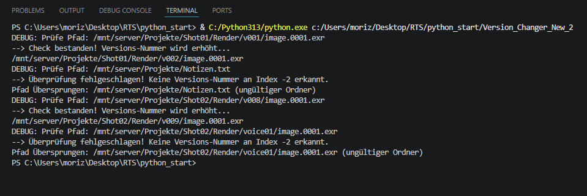

### RTS_6M / Technical Art & Automation
Welcome to my central learning repository. 
This file documents my transition from **professional photography** to **technical art**.
Using my visual expertise to create intelligent, automated creative pipelines.
Focusing on Python automation, Blender, AI-driven workflows and AI-Image/-Texture generation.

### Targets:
- **Python:** Developing clean code and modules following the Google Python Style Guide.
- **Blender:** Building custom tools and add-ons via the Blender API to streamline 3D workflows.
- **AI:** Using generative AI for high-end texturing, images and procedural asset creation.
- **Career Goal:** Relocating to Switzerland as a Technical Artist

### Learning Strategy:
Every project in this repository is **developed by myself**.
To consistently improve my skills through the process, I use AI as a pedagogical tool:

- **Guided Learning:** I use qwen 3.5:9b and Gemma4 with custom character-prompts as an python mentor. 
                 Instead of providing "copy-paste" code, the AI acts as an tutor, 
                 challenging my logic and guiding me towards solutions.
                 This ensures that I understand the code that I commit.
- **Quality Assurance:** To ensure the industry-leading standards, I use AI for logic verification and to check my documentation (following the Google Python Style Guide).

# --- Projects --- #

## 1. Versions_Changer
- **Challenge:** To manual update the version number of every file is time consuming and can lead to human errors especially by hundrets of files.
- **Key Features:** Scanns directory for files with a version number to update the number by 1.
- **Skills Applied:** Python (string manipulation and lists)
- **Evolution:** Version_Changer -> Version_Changer_New -> Version_Changer_New_2
- **Visual Data:** 

## 2. Tuple-Test (Tuple_Experiment)
* **Zweck:** Verständnis für Tuples 
* **Status:** Tuple_Experiment (Aktuell)
* **Pfad:** RTS_6M/Tuple_Experiment
* **Evolution:** ---
* **Nächster Commit:** ---

## 3. String-Übung (String-Verschlüsselung)
* **Zweck:** Teilt den Input in verschiedene Parts auf und fügt sie in einer neuen Reiehnfolge zusammen
* **Status:** String_Verschlüsselung (Aktuell)
* **Pfad:** RTS_6M/String_Verschlüsselung
* **Evolution:** ---
* **Nächster Commit:** ---

## 4. Speicherplatz kalkulieren (Speicherplatz_Rechner)
* **Zweck:** Berechnet anhand von anzahl der Frames und MB größe der Frames den benötigten Speicherplatz aus
* **Status:** Speicherplatz_Rechner (Aktuell)
* **Pfad:** RTS_6M/Speicherplatz_Rechner
* **Evolution:** ---
* **Nächster Commit:** ---

## 5. Render Zeit kalkulieren (Renderzeit_Kalkulator)
* **Zweck:** Berechnet anhand der Frames und Zeit pro Frame wie lang welches Projekt rendert (Minuten), gibt die jeweilige Zeit aus und das Projekt das am länsgetn dauert
* **Status:** Renderzeit_Kalkulator (Aktuell)
* **Pfad:** RTS_6M/Renderzeit_Kalkulator
* **Evolution:** Das Projekt wurde durch die Version "Smart_Rendering_Queue" entwickelt und optimiert
* **Nächster Commit:** ---

## 6. Asset Pfad Checker (Rendering_Queue_Checker)
* **Zweck:** Prüft ob der Pfad mit C: beginnt und ändert ihn in ein Linux Pfad
* **Status:** Rendering_Queue_Checker (Aktuell)
* **Pfad:** RTS_6m/Rendering_Queue_Checker
* **Evolution:** ---
* **Nächster Commit:** ---

## 7. Render Preisvergleich (Render_Preis_Vergleich)
* **Zweck:** Vergleicht Lokale Strom und Zeit kosten mit externen Kosten und Zeit angaben
* **Status:** Render_Preis_Vergleich (Aktuell)
* **Pfad:** RTS_6M/Render_Preis_Vergleich
* **Evolution:** ---
* **Nächster Commit:** ---

## 8. Elemente Zähler (Programm_Liste)
* **Zweck:** Zeigt Elemente einer Liste und die insgesamte Anzahl an
* **Status:** Programm_Liste (Aktuell)
* **Pfad:** RTS_6M/Programm_Liste
* **Evolution:** ---
* **Nächster Commit:** ---

## 9. Projekt Aufgabe/Info Anzeige (pipeline.py)
* **Zweck:** Fragt Projekt Name und Künstler Name ab, zeigt offene To-Do´s, fügt eins hinzu, zeigt die Anzahl aller To-Do´s. Skaliert die Auflösung und rechnet die Gesamte Pixel Anzahl
* **Status:** pipeline.py (Aktuell)
* **Pfad:** RTS_6M/pipeline.py
* **Evolution:** ---
* **Nächster Commit:** ---

## 10. Sortiert Bilder/Videos in Unterornder nach Datum (Picture_Date_Organizer.py)
* **Zweck:** Ein Programm mit GUI das den Nutzer nach einem Ordner frägt, diesen scannt, anzeigt wie viele Dateien von welcher Kategorie gefunden wurden.
            Nutzer wird nach Ziel-Ordner gefragt und kann entscheiden ob die Daten kopiert oder verschoben werden sollen. Während des Prozesses wird ein Ladebalken angezeigt und die verbleibende Zeit wird berechnet. Log Datei wird geschrieben und der Nutzer bekommt eine Meldung wie viele Dateien von welcher Kategorie erfolgreich verschoben wurden.
* **Status:** Picture_Date_Organizer.py (Aktuell)
* **Pfad:** RTS_6M/Picture_Date_Organizer.py
* **Evolution:** ---
* **Nächster Commit:** ---