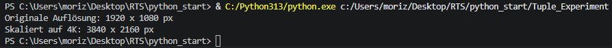
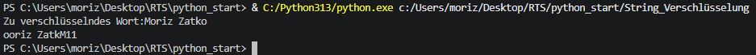
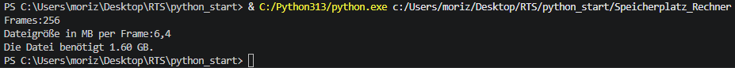

# RTS_6M / Technical Art & Automation
Welcome to my central learning repository. 
This file documents my transition from **professional photography** to **technical art**,
by using my visual expertise to create intelligent, automated creative pipelines.
Focusing on Python automation, Blender, AI-driven workflows and AI-Image/-Texture generation.

## Goals:
- **Python:** Developing clean code and modules following the Google Python Style Guide.
- **Blender:** Building custom tools and add-ons via the Blender API to streamline 3D workflows.
- **AI:** Using generative AI for high-end texturing, images and procedural asset creation.
- **Career Goal:** Relocating to Switzerland as a Technical Artist

## Learning Strategy:
Every project in this repository is **developed by myself**.
To consistently improve my skills through the process, I use AI as a pedagogical tool:

- **Guided Learning:** I use qwen 3.5:9b and Gemma4 with custom character-prompts as an python mentor. 
                 Instead of providing "copy-paste" code, the AI acts as an tutor, 
                 challenging my logic and guiding me towards solutions.
                 This ensures that I understand the code that I commit.
- **Quality Assurance:** To meet the industry-leading standards, I use AI for logic verification and to check my documentation (following the Google Python Style Guide).

# --- Projects --- #

## 1. Versions_Changer (File: Version_Changer_New_2)
- **Challenge:** To manual update the version number of every file is time consuming and can lead to human errors especially by hundrets of files.
- **Key Features:** Scanns internal list of given file paths for files with a version number and updates the number by 1.
- **Skills Applied:** Python (string manipulation and lists)
- **Evolution:** Version_Changer -> Version_Changer_New -> Version_Changer_New_2
- **Visual Data:** 

## 2. Resolution Scaling (File: Tuple_Experiment)
- **Challenge:** First touch with Tuples. Module scales pixel resolution by a given factor.
- **Key Features:** scales given pixel resolutions by a given factor.
- **Skills Applied:** Python (Tuples, Function)
- **Evolution:** None. 
- **Visual Data:** 

## 3. String Reordering (File: String_Verschlüsselung)
- **Challenge:** Reorders the user input
- **Key Features:** Asks user for input, reorders the input via string manipulation and adds them in a reverse order together,
                    with the total number of all letters at the end. Outputs the new string. 
- **Skills Applied:** Python (string manipulation, len() operator)
- **Evolution:** None. 
- **Visual Data:** 

## 4. Storage Calculator (File: Speicherplatz_Rechner)
- **Challenge:** Given only the number of frames and the size per frame we dont know the needed storage space for the rendering, this tool calculates it for you.
- **Key Features:** Asks user for total frames and the megabyte size per frame to calculate the needed storage space. Outputs the final string with two decimal places in gigabyte. 
                    Important: Tool accept only float and integer inputs NO STRINGS!
- **Skills Applied:** Python (Integers, Floats, simple math)
- **Evolution:** None. 
- **Visual Data:** 

## 5. Rendering Time/Price Calculator (Renderzeit_Kalkulator)
- **Challenge:** This Module calculates the needed rendering time and price and outputs it in several time units aswell as the rendering costs in euro.
- **Key Features:** Asks user for the project name, total number of frames, time in seconds per frame, and the rendering price per minute in euro.
                    Calculate and outputs four strings with the time results in seconds, minutes and hours aswell as the final rendering costs for the project. 
- **Skills Applied:** Python (Integers, Floats, simple math)
- **Evolution:** None. 
- **Visual Data:** 

## 6. Asset Pfad Checker (Rendering_Queue_Checker)
- **Challenge:** 
- **Key Features:** 
- **Skills Applied:** 
- **Evolution:** None. 
- **Visual Data:** 

* **Zweck:** Prüft ob der Pfad mit C: beginnt und ändert ihn in ein Linux Pfad
* **Status:** Rendering_Queue_Checker (Aktuell)
* **Pfad:** RTS_6m/Rendering_Queue_Checker
* **Evolution:** ---
* **Nächster Commit:** ---

## 7. Render Preisvergleich (Render_Preis_Vergleich)
- **Challenge:** 
- **Key Features:** 
- **Skills Applied:** 
- **Evolution:** None. 
- **Visual Data:** 

* **Zweck:** Vergleicht Lokale Strom und Zeit kosten mit externen Kosten und Zeit angaben
* **Status:** Render_Preis_Vergleich (Aktuell)
* **Pfad:** RTS_6M/Render_Preis_Vergleich
* **Evolution:** ---
* **Nächster Commit:** ---

## 8. Elemente Zähler (Programm_Liste)
- **Challenge:** 
- **Key Features:** 
- **Skills Applied:** 
- **Evolution:** None. 
- **Visual Data:** 

* **Zweck:** Zeigt Elemente einer Liste und die insgesamte Anzahl an
* **Status:** Programm_Liste (Aktuell)
* **Pfad:** RTS_6M/Programm_Liste
* **Evolution:** ---
* **Nächster Commit:** ---

## 9. Projekt Aufgabe/Info Anzeige (pipeline.py)
- **Challenge:** 
- **Key Features:** 
- **Skills Applied:** 
- **Evolution:** None. 
- **Visual Data:** 

* **Zweck:** Fragt Projekt Name und Künstler Name ab, zeigt offene To-Do´s, fügt eins hinzu, zeigt die Anzahl aller To-Do´s. Skaliert die Auflösung und rechnet die Gesamte Pixel Anzahl
* **Status:** pipeline.py (Aktuell)
* **Pfad:** RTS_6M/pipeline.py
* **Evolution:** ---
* **Nächster Commit:** ---

## 10. Sortiert Bilder/Videos in Unterornder nach Datum (Picture_Date_Organizer.py)- **Challenge:** 
- **Key Features:** 
- **Skills Applied:** 
- **Evolution:** None. 
- **Visual Data:** 

* **Zweck:** Ein Programm mit GUI das den Nutzer nach einem Ordner frägt, diesen scannt, anzeigt wie viele Dateien von welcher Kategorie gefunden wurden.
            Nutzer wird nach Ziel-Ordner gefragt und kann entscheiden ob die Daten kopiert oder verschoben werden sollen. Während des Prozesses wird ein Ladebalken angezeigt und die verbleibende Zeit wird berechnet. Log Datei wird geschrieben und der Nutzer bekommt eine Meldung wie viele Dateien von welcher Kategorie erfolgreich verschoben wurden.
* **Status:** Picture_Date_Organizer.py (Aktuell)
* **Pfad:** RTS_6M/Picture_Date_Organizer.py
* **Evolution:** ---
* **Nächster Commit:** ---

- **Challenge:** 
- **Key Features:** 
- **Skills Applied:** 
- **Evolution:** None. 
- **Visual Data:** 