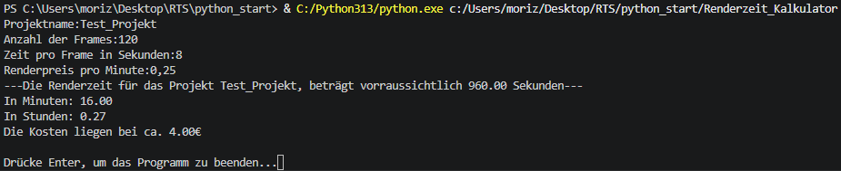
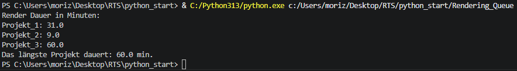
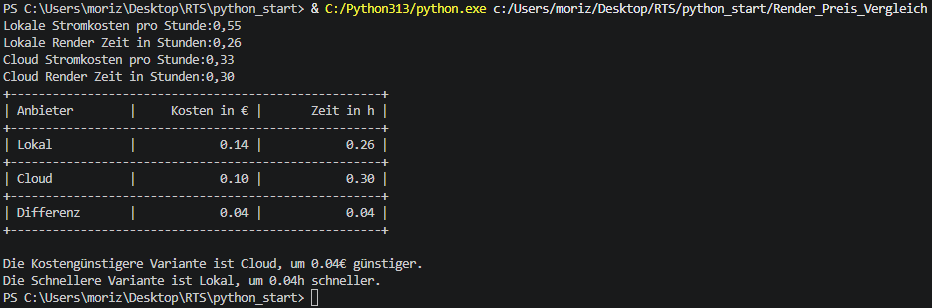
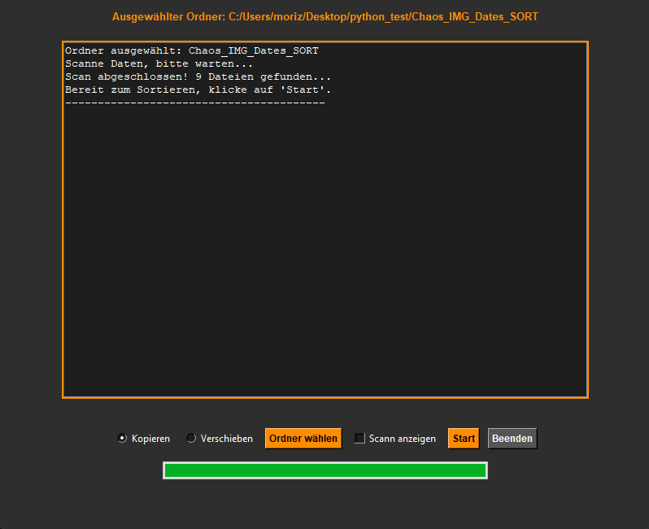
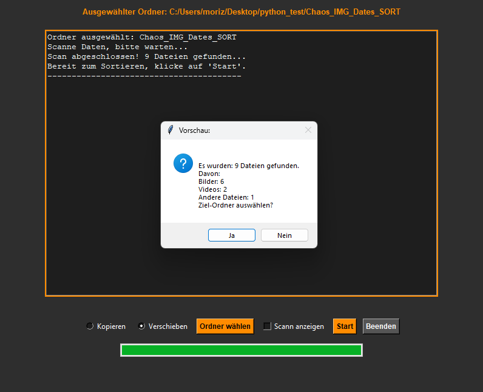
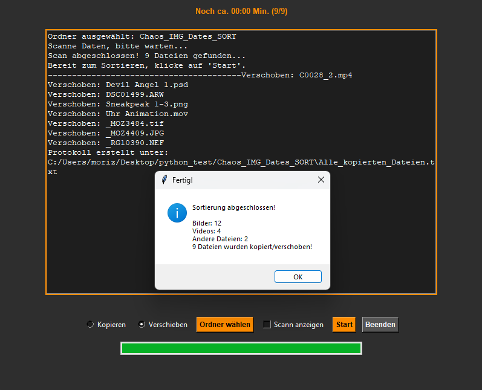
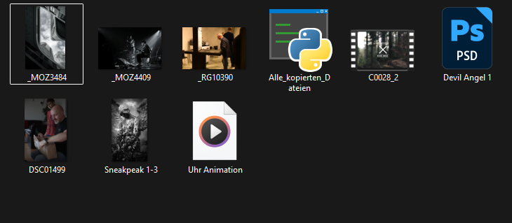
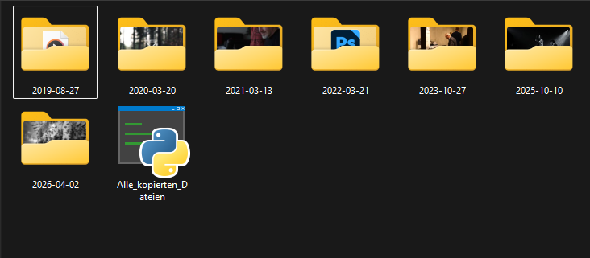
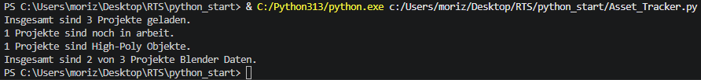

# RTS_6M / Technical Art & Automation
Welcome to my central learning repository. 
This file documents my transition from **professional photography** to **technical art**,
by using my visual expertise to create intelligent, automated creative pipelines.
Focusing on Python automation, Blender, AI-driven workflows and AI-Image/-Texture generation.

## Goals:
- **Python:** Developing clean code and modules following the Google Python Style Guide.
- **Blender:** Building custom tools and add-ons via the Blender API to streamline 3D workflows.
- **AI:** Using generative AI for high-end texturing, images and procedural asset creation.
- **Career Goal:** Relocating to Switzerland as a Technical Artist

## Learning Strategy:
Every project in this repository is **developed by myself**.
To consistently improve my skills through the process, I use AI as a pedagogical tool:

- **Guided Learning:** I use qwen 3.5:9b and Gemma4 with custom character-prompts as an python mentor. 
                 Instead of providing "copy-paste" code, the AI acts as an tutor, 
                 challenging my logic and guiding me towards solutions.
                 This ensures that I understand the code that I commit.
- **Quality Assurance:** To meet the industry-leading standards, I use AI and pydocstyle for logic verification and to check my documentation (following the Google Python Style Guide).

# --- Projects --- #

## 1. Versions Changer (File: Version_Changer_New_2.py)
- **Challenge:** To manually update the version number of every file is time consuming and can lead to human errors especially by hundreds of files.
- **Key Features:** Scanns internal list of given file paths for files with a version number and updates the number by 1.
- **Skills Applied:** Python (string manipulation and lists)
- **Evolution:** Version_Changer -> Version_Changer_New -> Version_Changer_New_2
- **Visual Data:** 

## 2. String Reordering (File: String_Reorder.py)
- **Challenge:** Reorders a string user input
- **Key Features:** Asks user for input, reorders the input via string manipulation and adds them in a reverse order together,
                    with the total number of all letters at the end. Outputs the new string. 
- **Skills Applied:** Python (string manipulation, len() operator)
- **Evolution:** None. 
- **Visual Data:** 

## 3. Rendering Time/Price Calculator (Rendertime_Calculator.py)
- **Challenge:** This Module calculates the needed rendering time and price and outputs it in several time units aswell as the rendering costs in euro.
- **Key Features:** Asks user for the project name, total number of frames, time in seconds per frame, and the rendering price per minute in euro.
                    Calculate and outputs four strings with the time results in seconds, minutes and hours aswell as the final rendering costs for the project. 
- **Skills Applied:** Python (Integers, Floats, simple math)
- **Evolution:** None. 
- **Visual Data:** 

## 4. Rendering Queue Calculator (File: Rendering_Queue.py)
- **Challenge:** Module calculates the expected rendering time for three given projects by total number of frames and time per frame in seconds.
- **Key Features:** Calculates the needed rendering time for three projects from a nested list. Outputs all results and the project with to longest rendering time.
- **Skills Applied:** Python (Nested-lists, Floats, simple math)
- **Evolution:** None. 
- **Visual Data:** 

## 5. Rendering Time And Price Comparison (File: Rendering_local_vs_cloud.py)
- **Challenge:** To decide if the project should be rendered local or off an cloud service, we need to compare costs and needed time.
- **Key Features:** Asks user for local rendering time in hours and costs per hour, same for the cloud option.
                    Calculates the cost and the difference between local and cloud. Outputs a string chart to compare the results,
                    as well as two strings with a recommendation for the fastest and the cheapest option.
- **Skills Applied:** Python (if/else, print string charts)
- **Evolution:** None. 
- **Visual Data:** 

## 6. Picture And Video Files Organizer (File: Picture_Date_Organizer.py) 
- **Challenge:** To sort directories with media files from different dates is time consuming and can lead to human errors.
- **Key Features:** Graphic interface, asks user for path to sort, user can decide whether data is copied or moved. Requests target path,
                    generates protocol as text file and outputs informations via GUI log and messagebox.
- **Skills Applied:** Python (Functions, Tkinter, mtime, Pillow, Colorama)
- **Evolution:** Foto_Datum_Sortierer_V1.py
- **Visual Data:** 
                   
                   
                   
                   

## 7. Asset Tracker For Nested List (File: Asset_Tracker.py)
- **Challenge:** Fast summary of different aspects from several projects.
- **Key Features:** Iterates through the hardcoded nested dictionary, checks different attributes to display a summary string.
- **Skills Applied:** Python (Functions, Args, Strings)
- **Evolution:** None. 
- **Visual Data:** 

# --- IN WORK ---
- **Challenge:** 
- **Key Features:** 
- **Skills Applied:** 
- **Evolution:** None. 
- **Visual Data:** 